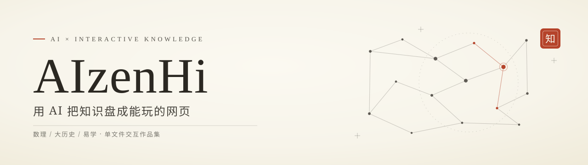

<picture>
  <source media="(prefers-color-scheme: dark)" srcset="assets/banner-dark.svg">
  
</picture>

## 你好，我是 AIzenHi 👋

一个把「学习」做成「作品」的人：**用 AI 辅助创作，把硬核知识变成能玩、能转、能探索的交互网页**。

不满足于"读完就算学会"——数理公式要能拖着看，几十亿年的历史要能滚着看，排盘推演要能点着看。
所有作品坚持 **单文件 · 打开即用 · 多数在线可玩**。

> *Turning hardcore knowledge into playable interactive pages — with AI as co-pilot.*

## 🧭 作品陈列

| 作品 | 一句话 | 直达 |
|---|---|---|
| 🗺️ **知识图集 Knowledge Atlas** | 11 件交互学习工具：线性代数 / 概率论 / 微积分 / 数学大陆 / 医学版图 / 宇宙史 / 地球 46 亿年 / 人类文明一万年…… | [在线玩](https://aizenhi.github.io/knowledge-atlas/) · [仓库](https://github.com/AIzenHi/knowledge-atlas) |
| 🖥️ **立体课本 · os-lab** | 操作系统运行实验台：从按下电源到进程运行的 3D 互动教学 | [在线玩](https://aizenhi.github.io/os-lab/) · [仓库](https://github.com/AIzenHi/os-lab) |
| ☯️ **易学实验室 · yijing-qimen** | 易经六十四卦图鉴 + 奇门遁甲排盘实验室（含 Python 排盘引擎与决策工具） | [在线玩](https://aizenhi.github.io/yijing-qimen/) · [仓库](https://github.com/AIzenHi/yijing-qimen) |
| 📊 **gh-rank** | 本地 GitHub 排行榜 + AI 通俗解读 | [仓库](https://github.com/AIzenHi/gh-rank) |

## 🎨 兴趣坐标

`数理科学` · `大历史` · `易学文化` · `交互可视化` · `AI 辅助创作` · `怀旧像素`

## ⚙️ 常用技术

`three.js` · `React / TypeScript` · `Python / FastAPI` · `Canvas / WebGL / GLSL` · `Vite`

---

  

<i>知之为知之，不知为不知，是知也。</i>

